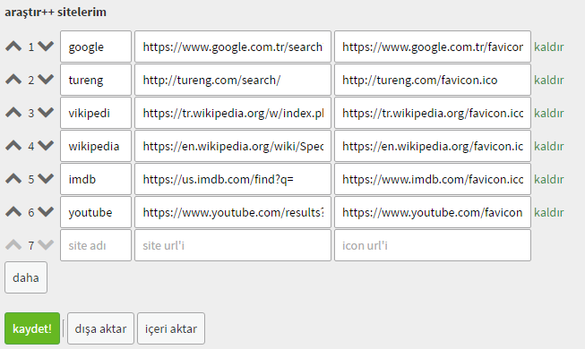

# araştır++
ekşi sözlük araştır linkleri geri geldi! ekşi sözlük başlığı: https://eksisozluk.com/arastir--4441723

# özellikler
* istediğiniz siteleri ekleyip çıkartabilirsiniz. kontrol sizde!
* siteleri istediğiniz gibi sıralayabilirsiniz.
* siteleri dışarı(yedekleyebilirsiniz) ya da içeri(yedekten geri yükleyebilirsiniz) aktarabilirsiniz.

# kurulum
her şeyden önce chrome kullanıyorsanız [tampermonkey](https://chrome.google.com/webstore/detail/tampermonkey/dhdgffkkebhmkfjojejmpbldmpobfkfo) eklentisini, firefox kullanıyorsanız [greasemonkey](https://addons.mozilla.org/en-US/firefox/addon/greasemonkey/) eklentisi kurun. daha sonra:

## programlama bilgisi olmayanlar ya da build ile uğraşmak istemeyenler için;
<!-- TODO: linkler master ile birleştirilince eklenecek -->
[ chrome için buraya tıklayın](https://github.com/erenhatirnaz/arastirpp/raw/master/dist/chrome/arastirpp.user.js) <br/>
[ firefox için buraya tıklayın](https://github.com/erenhatirnaz/arastirpp/raw/master/dist/firefox/arastirpp.user.js)

## "kendi buildimi kendim hazırlarım" diyenler için;

### malzemeler
* [nodejs](https://nodejs.org/en/)
* gulpjs global kurulumu (`npm install -g gulp` komutu ile kurulabilir)

### hazırlanışı
```bash
$ git clone https://github.com/erenhatirnaz/arastirpp.git
$ cd arastirpp
$ npm install
$ gulp build:all
```
ayrıca isteğe göre şu şekilde:
```bash
$ gulp build:chrome
```
ya da
```bash
$ gulp build:firefox
```
komutları ile sadece kullandığınız tarayıcı için build oluşturabilirsiniz. oluşturduğunuz build `dist` klasörü içerisinde yer alacaktır. daha sonra araştır butonunuzu servis etmek için tampermonkey/greasemonkey eklentisine hazırlamış olduğunuz buildi eklemeniz yeterli olacaktır. işte bu kadar artık araştır butonunuz emrinize amade.

# ekran görüntüleri



# katkı sağlamak için
bu depoyu forkladıktan sonra
```bash
$ git clone https://github.com/[kullanici_adin]/arastirpp.git
$ cd arastirpp
$ npm install
```
komutlarını çalıştırıp geliştirme ortamınızı hazır etmiş olursunuz. daha sonra pull request göndermeden önce `package.json` dosyasındaki `contributors` kısmına şu şekilde:
```json
<sizden önceki>,
"Adınız Soyadınız <e-posta adresiniz> (githup profil linkiniz ya da web siteniz)"
```
bir ekleme yaparsanız gönlümüzde yer edinip unutulmazsınız.
